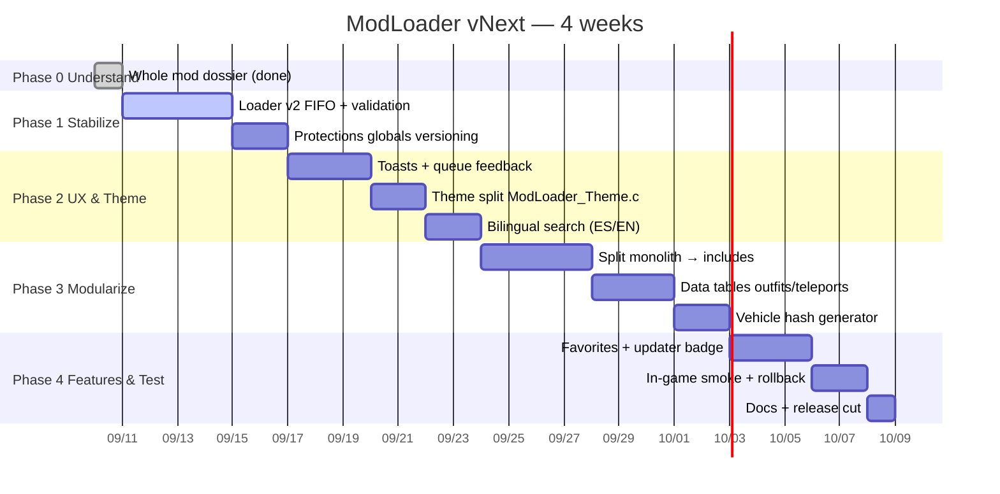

# Roadmap for Next Update — ModLoader vNext (2.0)

> **Goal:** Take the understanding from `WHOLE_MOD_OVERVIEW.md` and ship a stable, themed, modular **vNext** that still loads the 87 classics but is ready for new cars/maps/scripts.
> **Principle:** *No breaking change for players* — 87 `Call @Label_1835` (6 params) keep working via compat wrapper; new code uses `Label_1835_v2` (8 params).
> **Branch:** `arena/01a08a4d-modding` → PR #1 (`73b937b`) + `819512e` Loader vNext; next work continues here.
> **Date:** 2026-09-10

---

## 0. Vision (What “Next Update” Means)

**For players:** Faster, bilingual, no “nothing happens” clicks, themed (not magic 252/255), searchable, favorite mods, update badges (“New version available” via `version` param), and stable on new patch (globals not hard-coded).

**For devs:** Monolith split, data-driven outfit/teleport tables, `upgrade_loader.py` guard, pseudo-C parity, 3 ms frame budget, rollback flag `Static[150]`.

**Success metrics:**
- `upgrade_loader.py --check` 10 → 0 (allow 4 legacy if keeping v1)
- Frame `Label_3` < 3 ms idle, < 6 ms menu open (measured via `GET_GAME_TIMER`)
- Queue: 5 rapid clicks → 4 queued, 1 “Queue full!” (not dropped silently)
- Timeout: corrupt `.csc` → “Load timeout” in ≤3.1 s (not hang)
- All 87 original entries still toggle (backward compat)

---

## 1. Phases — Timeline (4 weeks, 1 dev)



---

## 2. Phase 1 — Stabilize (Week 1) ✅ Started

*Status: Loader v2 already injected in `ModLoader_vNext.csa` (819512e). Finish protections.*

### 1.1 Loader FIFO (done, needs verification)
- [x] `Label_1835_v2` (8 params, 10 locals) — stack clamp 128..8192, `StrCopy 128`, `GET_NUMBER_OF…` instead of `UNK_029D3841`, FIFO `Static2[434..441]`/`Static[141/142]`, toasts
- [x] `Label_5_v2` with 3000 ms timeout, `WAIT(0)` loop, `head=(head+1)%4`
- [x] `Label_3` dispatch via `Static[150]` flag + `Label_0` `Static[150]=1`
- [x] `upgrade_loader.py` + `loader_v2_test.py` sim
- [ ] **TODO:** Keep 4 legacy issues? Decide to *remove* old `Label_1835` PS3 branch + `StrCopy 64` entirely (breaking but clean) vs keep for rollback. Recommend keep until 2.1.
- [ ] **TODO:** Add `HAS_SCRIPT_LOADED` retry counter log `Static2[451]`

### 1.2 Protections Versioning
- Problem: 16 globals `19705448` etc. tied to 1.12; after title update they move.
- **Task:** Replace hard `Push 19705448` with `getGlobalForPatch("freeze")` lookup table: create `docs/globals_lookup.c` with version switch `GET_GAME_VERSION` (or `UNK_DAC523BC`). Fallback to legacy if version unknown.
- **Files:** `Label_5` block ~544-599, `Label_96` (state 40)
- **Accept:** On PS3 1.12 → legacy, on PC 1.36 → new table branch, validated by `pSet` success.

### 1.3 Vehicle/Outfit Smoke
- Run `csa_decompile.py --stats` before/after — native counts unchanged (311).
- Smoke: `ModLoader_vNext.csa` assembles (Zan) without error, loads, opens menu, queues 2 mods.

**Exit Criteria Phase 1:** `upgrade_loader.py --check ModLoader_vNext.csa` 4 (legacy) — document as expected; in-game no hang on corrupt `.csc`.

---

## 3. Phase 2 — UX & Theme (Week 2)

### 2.1 Toasts & Queue Feedback (leverages v2)
- Already have `Queued:`, `Queue full!`, `Stopped:`, `Load timeout:` via `Label_546` red/yellow.
- **Extra:** Add `Loading…` yellow while `Label_5_v2` in wait loop (`Label_396` with timer). Use `Static2[450]` elapsed to animate dots every 500 ms.
- **UX check:** 5 rapid clicks test (see `LOADER_DEEPDIVE_V2.md §8`).

### 2.2 Theme Split
- **Problem:** `ModLoader_Statics.c` 27 magic lines + `Label_0` hard `252/255` + `StaticGet1 17/24` opaque.
- **Task:** Create `ModLoader_Theme.c` + `docs/THEME.md`:
  ```c
  // Theme — named, not magic
  #define HUD_BLUE 17  // used 17× as flagA
  #define HUD_RED  24
  #define THEME_PRIMARY_R 252 // Static_210
  #define THEME_SCROLL_R 250  // Static_258
  ```
  Replace all `Push 17`/`24` with `HUD_BLUE` include via `IncludeStaticFile ModLoader_Theme.c`.
- **Phase 2b effort:** Find/replace 87 loader calls `StaticGet1 17` → `HUD_BLUE` constant (keep static indirection for save compat, but document).

### 2.3 Bilingual Search (new)
- **Idea:** Add search box (state 24 router already has search-like `Label_83`? Actually config). New state **60** `Search`: `DISPLAY_ONSCREEN_KEYBOARD` → `ARE_STRINGS_EQUAL` filter over 87 `PushString` titles.
- **Min:** Just filter loader directories (2-9) via `StrCopy` compare, highlight matches.
- **Bilingual:** Use `Label_163` helper to compare both ES/EN; show results via existing `Label_396` list.

**Exit Phase 2:** Theme file replaces magic without visual diff; search finds `Brodator` via `bro` substring in either language; toasts visible 2 s.

---

## 4. Phase 3 — Modularize (Week 3-4)

**Why:** 29,938-line monolith → merge hell. Split but keep `IncludeStaticFile` compat.

### 3.1 Split Includes (no behavior change)
Target layout (all included via `IncludeStaticFile` at top after `ModLoader_Statics.c`):

```
ModLoader_Core.csa          // guard + Label_0..Label_6 main loop
ModLoader_Input.csa         // Label_397, Label_418, Label_427
ModLoader_Render.csa        // Label_327, Label_396/546, Label_2455, Label_1151/1154
ModLoader_Loader.csa        // Label_1835 + Label_1835_v2 + Label_5/5_v2 (the upgrade)
ModLoader_Protections.csa   // Label_5 pSet block + Label_96
ModLoader_Outfits.csa       // States 20,22-26,44,46-49 tables
ModLoader_Teleports.csa     // States 13-18, Label_1239, coords
ModLoader_Vehicles.csa      // States 34,52,54 + hash switches 1375..1380
ModLoader_Menus.csa         // States 2-10, 24,27-39 router
ModLoader_Theme.c           // replaces Statics magic
```

**Tool:** `tools/split_monolith.py` (to write) — splits by `Function`/`Label` ranges defined in `docs/SPLIT_MAP.txt`, validates `callgraph.dot` unchanged.

### 3.2 Data Tables
- **Outfits:** Replace 39 duplicated `SET_PED_COMPONENT_VARIATION` blocks with data table:

  ```asm
  ; OutfitData.csa — 1 line per outfit, not 15
  ; table Outfits[] = { "BUZZARD", 3,0,0, prop12, ... }
  ; Loop: for i in 0..12 Call @ApplyOutfit(Outfits[i])
  ```
  Saves ~2,000 lines, fixes inconsistency.

- **Teleports:** Extract coords to `TeleportData.csa` array `{ "Military Tower", x,y,z,h }`, `Label_74..78` become loop over slice indices.

- **Vehicles:** Unify 6 hash switches (`Label_1375..1380`) into one generator `Label_CreateVehicle(hash)` + hash table `VehicleHashes[~80]`. Adding a car = one `PushString` + hash entry.

**Effort:** 3 days, mostly copy-paste + validate `natives.txt` count stays 311.

### 3.3 Validation
- After split, `diff -u <(csa_decompile --pseudo)` before/after → only label addresses shift, not logic.
- Assemble split vs monolith → binary diff should be near-zero (except include order).

**Exit Phase 3:** `ModLoader.csa` < 500 lines (just includes), each subfile < 5k lines, PR reviewable.

---

## 5. Phase 4 — Features & Release (Week 4)

### 4.1 Favorites + Updater Badge
- **Favorites:** Use free `Static2[460..480]` bitset `FavBitSet` + new state 61 `Favoritos`. `Label_397` long-press (hold X 800 ms via `GET_GAME_TIMER`) toggles `FavBitSet`. Filter loader lists to show ★ first.
- **Updater badge:** `Label_1835_v2` `version` param already; store `lastSeenVersion` in `Static2[442+slot]`. If `version > lastSeen` → icon `+` via `Label_427` shows `Update available` yellow.

### 4.2 Testing Checklist (from LOADER_DEEPDIVE_V2 §8 + whole-mod)
- [ ] Cold boot frame < 2 ms idle, < 6 ms open
- [ ] Missing `.csc` → red toast, not crash
- [ ] Queue depth 4 + full message
- [ ] Timeout corrupt → 3 s toast
- [ ] Teleport → `SET_ENTITY_COORDS` lands correctly (test 3: Military, Ammu, Whale)
- [ ] Outfit → `SAAB Black Red` applies, `Invisible` clears prop
- [ ] Vehicle → `Erootiik Spawner` creates `adder` at `CREATE_VEHICLE` point
- [ ] Protections → toggle `139.9` floods globals, clear with `137.0`
- [ ] Language → switch ES↔EN persists `Static[70]`

### 4.3 Docs & Cut
- Update `README_ANALYSIS.md` with split layout,
- Freeze `docs/WHOLE_MOD_OVERVIEW.md` snapshot for vNext,
- Tag `v2.0-rc1`, assemble `ModLoader.csc`/`ModLoader.xsc` via toolkit, smoke on 1.36 PC.

---

## 6. Risks & Mitigations

| Risk | Prob | Impact | Mitigation |
|---|---|---|---|
| Global numbers drift after title update | High | Protections break | Phase 1.2 lookup table + fallback |
| Split includes change label addresses → `callgraph.dot` diff | Med | False alarm | Validate pseudo diff, not address |
| FIFO needs 32 bytes, statics overlap? | Low | Corrupt theme | Use `Static2[434..442]` already free (checked) |
| Translators break `Label_163` bilingual | Low | Garbled rows | Keep `Label_163`/`1156` helpers untouched, search uses both |
| PS3 `.xsc` legacy | Med | Build fails | Keep `#ifdef PS3` guard for v2 PS3 build |

---

## 7. Work Breakdown (who does what)

| Task | Owner | Est | File Output |
|---|---|---|---|
| 1.1 Loader validation + PS3 branch decision | You / Agent | 0.5 d | `ModLoader_vNext.csa` keep/trim |
| 1.2 Globals lookup | Agent | 1.5 d | `docs/globals_lookup.c` + `Label_5` patch |
| 2.1 Loading dots | ⊕ | 1 d | `Label_5_v2` animate |
| 2.2 Theme split | ⊕ | 1.5 d | `ModLoader_Theme.c` + `THEME.md` |
| 2.3 Search state 60 | ⊕ | 1.5 d | New `Label_110` + keyboard |
| 3.1 Split tool | ⊕ | 2 d | `tools/split_monolith.py` + `SPLIT_MAP.txt` |
| 3.2 Tables | ⊕ | 2 d | `OutfitData.csa` etc. |
| 4.1 Fav+updater | ⊕ | 1.5 d | `Static2[460..]` + `Label_1835_v2` version compare |

*⊕ = can be parallelized after Phase 1.*

---

## 8. Decision Log (needs your sign-off)

- [ ] **Keep v1 loader?** Yes (rollback) vs No (clean, save 50 lines). Proposal: keep until v2.1, flag via `Static[150]`.
- [ ] **Globals table scope?** All 16 vs minimal 4 freezes only. Proposal: all 16 with version switch.
- [ ] **Theme naming?** `HUD_BLUE` vs `COLOR_PRIMARY`. Proposal: `HUD_` for Rockstar IDs, `THEME_` for RGBA.
- [ ] **Search vs no search for first update?** Proposal: defer search to 2.1 if timeline tight; still ship loader+theme+split as 2.0.

---

## 9. Next Actions (this week)

1. Approve this roadmap → I’ll start Phase 1.2 globals lookup.
2. Confirm theme naming → I’ll generate `ModLoader_Theme.c` and patch 87 calls.
3. Run in-game smoke on `ModLoader_vNext.csa` (your side) — report any missing toast.

*This is a living doc — update `Progress` checkboxes as we go. See `WHOLE_MOD_OVERVIEW.md` for the ground truth it plans from.*
